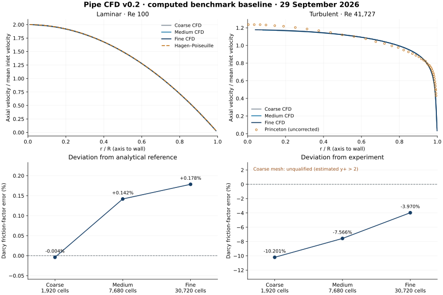

# Measured baseline · 29 September 2026

These are actual Foundation OpenFOAM 14 runs (build `14-7b05503f98a8`), using the checked-in pipe generator and benchmark presets. Execution was serial. Solver and post-processing source: [0d85627](https://github.com/MichaelBialocur/JJC-Open-Foam-UI/commit/0d8562794fef0717f2597b04917ae7294f224431). All cases passed `checkMesh`. No analytical field, empirical friction formula or reference curve was used to replace CFD output. No physical coefficients were fitted to the experiment.

Full inputs, numerical metrics, qualification checks and sampled profiles are in [benchmark-summary.json](benchmark-summary.json). See [validation methods and sources](VALIDATION.md) for assumptions and the exact qualification policy.

## Laminar verification · Re 100

| Mesh | Cells | Darcy f | Friction error | Profile RMSE (% of mean U) | Points | Estimated y+ | Qualification |
|---|---:|---:|---:|---:|---:|---:|---|
| Coarse | 1,920 | 0.63997392 | -0.0041% | 0.3421 | 16 | 0.437 | Within project screening target |
| Medium | 7,680 | 0.64090735 | +0.1418% | 0.1866 | 32 | 0.220 | Within project screening target |
| Fine | 30,720 | 0.64114179 | +0.1784% | 0.1714 | 64 | 0.110 | Within project screening target |

Darcy f changes by 0.1456% from coarse to medium and 0.0366% from medium to fine, relative to the finer value.

The analytical reference is Darcy f = 0.64. Near-zero coarse-grid friction error is not evidence that the coarse mesh is superior: discretization and fixed-angle geometry errors can cancel. The profile error decreases with refinement, while friction approaches a small positive offset. Axial/radial refinement does not remove the 5° wedge approximation. This is analytical verification, not experimental validation.

## Experimental comparison · Re 41,727

| Mesh | Cells | Darcy f | Friction error | Profile RMSE (% of mean U) | Points | Estimated y+ | Qualification |
|---|---:|---:|---:|---:|---:|---:|---|
| Coarse | 1,920 | 0.01962834 | -10.2007% | 6.4722 | 37 | 2.405 | Unqualified |
| Medium | 7,680 | 0.02020418 | -7.5662% | 5.6913 | 39 | 1.264 | Within project screening target |
| Fine | 30,720 | 0.02099015 | -3.9704% | 5.3034 | 40 | 0.655 | Within project screening target |

Darcy f changes by 2.8501% from coarse to medium and 3.7444% from medium to fine, relative to the finer value.

**Mesh independence has not been established for the turbulent case.** The final refinement changes f by 3.74%, and that change is larger than the preceding refinement. Agreement with the experiment on the fine grid is preliminary. Extend radial/axial refinement and angular sensitivity before treating the remaining experimental deviation as turbulence-model error; no GCI or mesh-converged accuracy claim is made.

The supplied experimental Darcy f is 0.021858. The coarse grid fails the chosen near-wall criterion (estimated y+ > 2) and its comparison is unqualified. The friction deficit and profile mismatch are reported without tuning the model. The point count changes with radial coverage; RMSE comparisons do not use identical sampling subsets on every mesh.

**The Princeton file contains original, uncorrected measurements.** Pitot-displacement and other corrections were not applied, and its per-point measurement uncertainty is unspecified. The 10% screening target is a project choice, not a published uncertainty or a claim of general model accuracy. Further angular refinement, inlet/domain sensitivity and corrected experimental datasets are needed before assigning the remaining discrepancy to the turbulence model.



## Numerical checks and reproduction

All six runs reached their prescribed iteration limits (2,500 laminar; 4,000 turbulent). The separate physical-residual and saved-field stationarity checks determine convergence. Relative Uz residuals remain noisy at round-off-level swirl; the raw residual, swirl magnitude, final saved iteration and stationarity metrics are retained in the JSON. This is not labelled an OpenFOAM convergence-stop message.

Maximum inlet/outlet face-flux imbalance: 2.39e-10%. Maximum developed-gradient drift: 5.11e-06%. Maximum downstream-profile drift: 3.42e-06% of mean inlet velocity.

```bash
.venv/bin/python scripts/validate.py --case all
```

The command regenerates six cases and writes a fresh `validation-output/summary.json`; numerical round-off and runtimes can differ across systems. Full CFD fields and logs stay outside Git. The repository stores this small baseline so future model changes can be compared with it.

Implementation checks: 14 automated backend tests; frontend production build and lint; real HTTP run, JSON/CSV/case export, persisted history, three-mesh queue and active/queued cancellation; DOM integration of a real run and result charts; startup script and Ctrl+C cleanup. Browser rendering was blocked by this execution environment, so a visual layout review remains to be done in the user browser.
