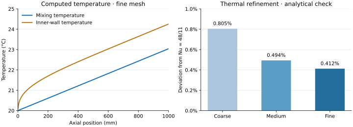

# Measured fluid-heating benchmarks · 2026-09-30

Foundation OpenFOAM 14, build `14-7b05503f98a8`, serial CPU execution. Results below come from written temperature fields and computed flow fields. The temperature equation does not use a Nusselt correlation. Machine-readable inputs, flow provenance, metrics and the fine-mesh temperature profile are in [thermal-benchmarks.json](thermal-benchmarks.json).

## Laminar verification and mesh refinement

Uniform inner-wall heating of 10 W; Tin=20 °C; D=10 mm; L=1000 mm; Re=100; rho=998 kg/m³; mu=0.001002 Pa·s; Cp=4182 J/(kg K); fluid k=0.6 W/(m K). Properties remain constant. The ideal adiabatic bulk rise is 3.038494 K. This is a forced-convection numerical benchmark with buoyancy disabled, not a prediction of every physical orientation of this low-speed heated-water pipe.

Reference: fully developed laminar constant-flux limit **Nu = 48/11 = 4.363636…**, [NPTEL / IIT Kharagpur, S. Chakraborty, Lecture 29](https://archive.nptel.ac.in/content/storage2/courses/103105052/AdvHeatMass_L_29.pdf). See [method and qualification gates](VALIDATION.md#fluid-heating-analytical-verification-added-in-v03).

| Mesh | Cells | Developed Nu | Deviation from analytical Nu | Nu change from coarser | Outlet mixing T (°C) | Energy imbalance (%) |
|---|---:|---:|---:|---:|---:|---:|
| Coarse, 120 × 16 | 1,920 | 4.398777 | +0.8053% | — | 23.038344 | 1.72e-9 |
| Medium, 240 × 32 | 7,680 | 4.385177 | +0.4936% | 0.3101% | 23.038329 | 7.63e-10 |
| Fine, 480 × 64 | 30,720 | 4.381636 | +0.4125% | 0.0808% | 23.038322 | 1.99e-8 |

All three pass the current convergence, conservation, development and 2% analytical screening gates. Nu is averaged over 65–85% of length, not taken from the inlet. Nu drift between downstream intervals is 0.243%, 0.226% and 0.219%. Temperature residuals are below 1e-11 and the last two saved temperature fields are stationary at written precision. The balances include the small conductive loss through the inlet: 0.000492, 0.000542 and 0.000567 W, respectively.



The thermal study reused the three **actual converged OpenFOAM flow fields** from the v0.2 laminar benchmark, without altering velocity, pressure or fluxes. This is appropriate for a one-way energy equation and avoids repeating an unchanged flow solve. The recorded flow case IDs identify those fields. A separate fresh coarse case was run through meshing, flow, temperature, postprocessing and exports and reproduced the coarse thermal result.

Remaining differences include spatial discretization, finite development length and the fixed planar 5° wedge approximation. The small medium-to-fine Nu change does not demonstrate angular convergence or universal thermal accuracy. No coefficient was tuned to match the analytical limit. No heated-pipe experiment has yet been used for validation.

## Turbulent implementation / conservation check

Using the existing medium Princeton flow case, air Cp=1007 J/(kg K), fluid k=0.0263 W/(m K), Prt=0.85 and 100 W inner-wall heating gave:

- Outlet mixing temperature: 28.247021 °C from a 26.98 °C inlet.
- Convected heat: 99.999067 W; inlet conduction: 0.000933 W.
- Energy imbalance: 6.96e-9%; temperature convergence passed.
- Computed developed Nu: 89.58048, **unqualified against a thermal reference**.

This checks the turbulent-diffusivity path and conservation, not the accuracy of turbulent heat transfer. The existing [flow experiment limitations and unresolved turbulent grid sensitivity](BENCHMARKS.md) still apply. Prt is an explicit assumption; material/solid conduction, buoyancy, phase change and property feedback remain outside the model.

## Reproduce

For completely fresh flow and thermal runs on all three meshes:

```bash
.venv/bin/python scripts/validate.py --case heated_laminar --output validation-output/heated
```

To repeat the energy study on your existing matching Re=100 benchmark cases:

```bash
.venv/bin/python scripts/validate_thermal.py /path/to/coarse-case /path/to/medium-case /path/to/fine-case
```

The second command checks the saved input contract, requires converged flow and records the source case. It creates new cases and leaves the source flow fields intact. Generated simulation files remain outside Git. `scripts/render_thermal_benchmark.py` redraws this report's figure from the committed measured summary and requires Matplotlib.

## Application verification

Backend and frontend numerical/data-contract tests, lint and production build passed. Actual live API checks covered saved run loading, field JSON, VTK, thermal CSV and case ZIP. The real compiled React app passed a DOM integration check with the live API: heated preset, SVG 3D orbit/reset, field choice, section slider, cell probe, thermal metrics and round/zero chart ticks. Browser launch was blocked by the execution sandbox; full WebGL rendering and browser layout have not been visually verified in this environment. The SVG fallback and charts were rendered for inspection.
